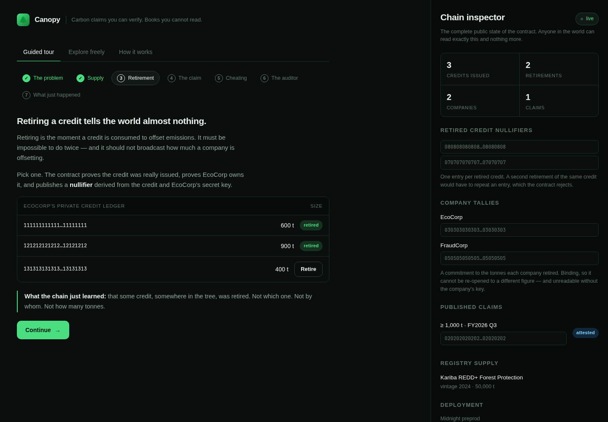
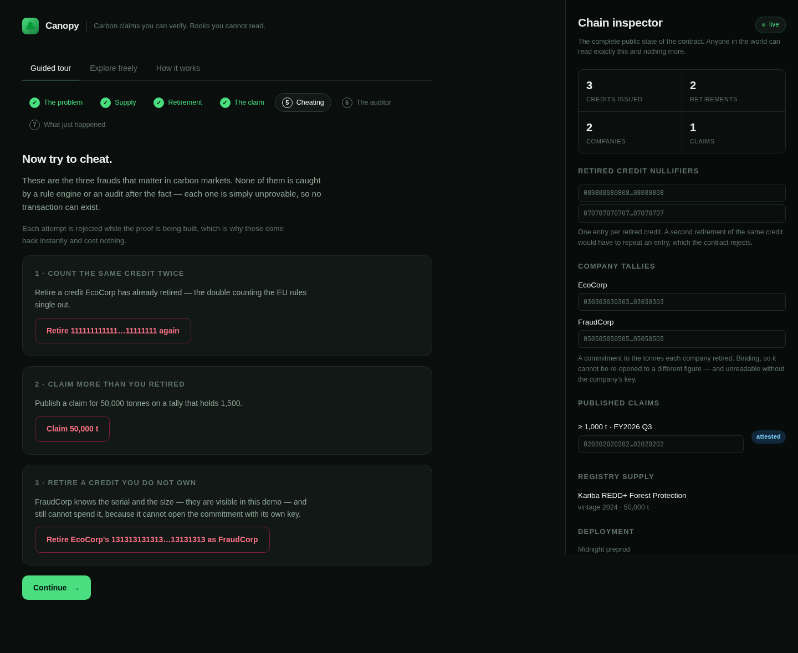
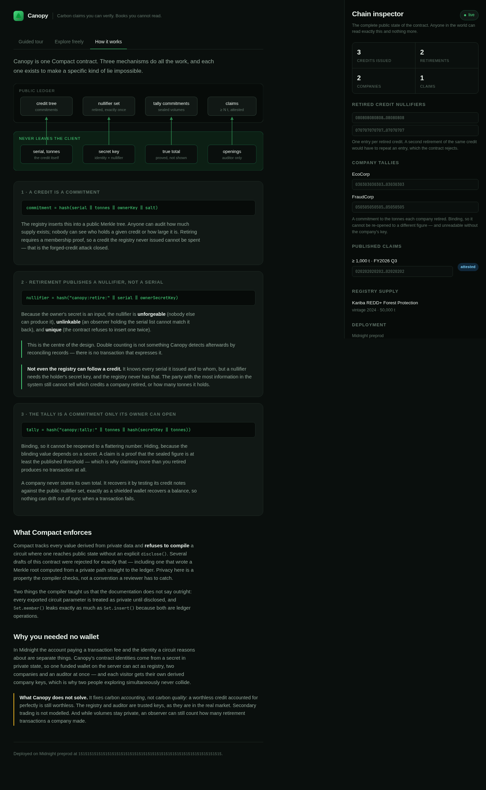

# Canopy

**Carbon claims you can verify. Books you cannot read.**

Canopy is a carbon credit registry on [Midnight](https://midnight.network) where
retiring a credit is publicly, permanently unrepeatable — and where nothing
about a company's offset volumes ever reaches the chain.

A company can prove *"in FY2026 Q3 we retired at least 1,000 tonnes"* without
revealing the real figure, which credits it used, or what it still holds. An
accredited auditor can be shown everything. Everyone else sees a hash.

---

## The problem

In 2022 the crypto industry tried to fix carbon markets. Toucan bridged roughly
22 million Verra-registered credits onto a public chain. Verra responded by
[banning tokenisation outright](https://carboncredits.com/verra-suspension-carbon-credits-proposes-immobilizing-credits/).

The failure was architectural, not ideological. On a transparent-by-default
ledger:

- every company's offset position — and therefore its emissions profile — is
  public to its competitors;
- a registry has no cryptographic way to stop a retired credit from continuing
  to trade;
- "double counting" is something you detect afterwards by reading records,
  rather than something the system makes impossible.

Meanwhile the compliance pressure has only increased. From **September 2026**
the EU Green Claims Directive makes unsubstantiated offset-based "climate
neutral" claims illegal across the EU, prohibits self-certification, and
requires verification by an accredited body with no financial interest in the
outcome. CSRD/ESRS E1 names avoidance of double counting as a reporting
integrity requirement.

So the market needs two things that normally contradict each other:

| Public | Private |
| --- | --- |
| Proof a credit was retired exactly once | How many tonnes a company retired |
| Proof a claim is backed by real retirements | Which credits back it |
| Which registry and auditor are authoritative | The company's commercial position |

That is not a transparency problem or a privacy problem. It is a *selective
disclosure* problem, which is precisely what Midnight is for.

---

## How Canopy works

One Compact contract, four roles, one loop.

```
Registry  ──issues──▶  credit commitment  ──▶ public Merkle tree
                                              (supply is auditable,
                                               ownership is not)

Company   ──retires──▶ nullifier          ──▶ public nullifier set
                       (unforgeable,           (double retirement is
                        unlinkable)             structurally impossible)
                     ──folds tonnage into──▶ private tally commitment

Company   ──claims───▶ "≥ N tonnes, FY2026 Q3"
                       proved against the sealed tally

Auditor   ──attests──▶ on-chain attestation
                       after off-chain disclosure of the openings
```

### What each mechanism buys

**Credits are commitments.** A credit enters the chain as
`hash(serial, tonnes, ownerKey, salt)`. The registry publishes its batch totals
— that is what a registry is for — but the individual holder and size are known
only to the holder.

**Retirement publishes a nullifier, not a serial.** The nullifier is
`hash("canopy:retire:", serial, ownerSecretKey)`. Because it depends on the
owner's secret it cannot be forged by anyone else, and it cannot be matched back
to a published serial by an observer. Inserting it twice is rejected by the
contract, so double counting is not *detected* — it is unrepresentable.

**The tally is a commitment the company alone can open.** Each company's public
entry is `hash("canopy:tally:", tonnes, hash(secretKey, tonnes))`. It is binding
(it cannot be re-opened to a different number) and hiding (the blinding value
depends on a secret). A claim is a proof that the sealed number is at least the
published threshold.

**Not even the registry can follow a credit.** The registry knows every serial
it issued and who it issued it to — and still cannot tell which credits were
retired or how many tonnes a company holds, because both the nullifier and the
tally nonce require the holder's secret key. The best-informed party in the
system learns nothing.

**The tally is reconstructed, never stored.** A company recovers its own total
by testing its credit notes against the public nullifier set — the same way a
shielded wallet recovers a balance. There is no local counter to drift out of
sync if a transaction fails.

**Roles are separated by domain-separated key derivation.** Registry, auditor
and company public keys are derived from distinct prefixes, so a company key can
never be replayed as a registry key.

### Why this needs Midnight specifically

- **Public and private state in one contract.** The nullifier set has to be
  public for uniqueness to mean anything; the tonnages have to be private for
  the product to be usable. Midnight is the platform where both live in the same
  ledger.
- **Witness data never leaves the client.** Tonnages, serials and salts are
  witnesses. They are inputs to the proof, not to the chain.
- **`disclose()` is mandatory and compiler-enforced.** Compact statically tracks
  every value derived from a witness and refuses to compile a circuit that lets
  one reach public state without an explicit `disclose()`. Privacy is a
  compile-time property here, not a code-review convention. Building Canopy, the
  compiler rejected several early drafts for exactly this reason.

---

## Try it



*The company's private credit ledger on the left; the complete public state of
the contract on the right. Retiring moves a nullifier into the public set and
tells the world nothing else.*

The deployed demo needs no wallet, no extension and no signup. One funded
wallet on the backend pays the fees; the four roles are separate *contract*
identities derived per visitor, so two people exploring at once never collide.

Every button writes a real transaction to the deployed contract. The attempts
that are supposed to fail fail during local circuit execution, which is why they
come back instantly and cost nothing.



The site also explains its own cryptography, so evaluating Canopy needs no
clone of this repository:



---

## Running it yourself

### Prerequisites

- Node.js 24+ (see `.nvmrc`)
- Docker
- The Compact toolchain:
  ```bash
  curl --proto '=https' --tlsv1.2 -LsSf \
    https://github.com/midnightntwrk/compact/releases/latest/download/compact-installer.sh | sh
  export PATH="$HOME/.local/bin:$PATH"
  compact update
  ```
  Canopy is built against compiler `0.31.1` (language `0.23.0`, ledger
  `8.0.2`, runtime `0.16.0`).

### Build

```bash
npm install

# compile the contract and generate proving keys (~3 minutes)
npm run compact --workspace @canopy/contract
npm run build   --workspace @canopy/contract

# the contract's own test suite — no network required
npm test        --workspace @canopy/contract
```

### Run

```bash
# proof server
docker run -d --name canopy-proof-server -p 6300:6300 \
  -e PORT=6300 midnightntwrk/proof-server:8.1.0

# deploy to Midnight PreProd — prints the fee wallet address, waits for you to
# fund it once at https://midnight-tmnight-preprod.nethermind.dev/, then
# registers DUST and deploys by itself
CANOPY_NETWORK=preprod npm run deploy-contract --workspace @canopy/server

# backend + frontend
npm run build --workspace @canopy/web
npm start     --workspace @canopy/server     # serves the UI and the API on :3001
```

For frontend development, `npm run dev --workspace @canopy/web` proxies `/api`
to the backend on port 3001.

### Configuration

| Variable | Default | Meaning |
| --- | --- | --- |
| `CANOPY_NETWORK` | `preview` | `preview` or `preprod`. The public demo runs on `preprod`, because the Preview faucet was down (`NOT_SERVING / SYNC_STUCK_RECOVERY`) while this was built. |
| `CANOPY_PROOF_SERVER` | `http://127.0.0.1:6300` | Proof server URL |
| `CANOPY_SEED` | a development seed | Master seed for the fee wallet and role keys |
| `PORT` | `3001` | Backend port |

`CANOPY_SEED` derives everything: change it and you get a different fee wallet
and different registry/auditor identities, which means you must redeploy. To
reuse a wallet you have already funded, set `CANOPY_WALLET_SEED` to its seed
instead — that skips the captcha-gated faucet entirely.

---

## Layout

```
contract/   canopy.compact, witnesses, and the simulator test suite
server/     Express API, fee wallet, per-visitor session identities
web/        React frontend — the guided tour and the chain inspector
docs/       architecture, deployment, submission notes
```

`contract/src/canopy.compact` is the whole protocol and is worth reading first;
it is about 200 lines.

- [docs/architecture.md](docs/architecture.md) — the data model, the three
  mechanisms, and what the Compact compiler enforces
- [docs/deployment.md](docs/deployment.md) — standing up the public demo

---

## Tests

`contract/src/test/canopy.test.ts` runs the contract in-process, so the full
four-role story and every way of cheating at it are exercised without a node, a
wallet or a proof server:

- a credit cannot be retired twice
- a credit cannot be retired by someone who does not own it
- a credit the registry never issued cannot be retired
- **a dishonest prover cannot substitute someone else's Merkle path** — this one
  installs a deliberately lying `creditPath` witness, because fraud tested
  through the honest witness implementation proves nothing about the circuit
- a claim larger than what was retired cannot be published
- a company that retired nothing can claim nothing
- only the accredited auditor can attest
- only the registry can issue supply
- two companies' tallies stay independent and mutually opaque
- the on-chain tally is a commitment, and no nullifier equals its serial

---

## Honest limitations

These are real, and stating them is more useful than pretending otherwise.

- **Accounting, not quality.** Canopy guarantees a credit is retired once and
  that claims are backed. It says nothing about whether the underlying project
  ever avoided a tonne of carbon. Junk credits accounted for perfectly are still
  junk. Integrating project-rating attestations is the obvious next layer.
- **Trusted registry and auditor.** Both are permissioned keys fixed at
  deployment, mirroring how real registries and accredited verifiers work. A
  production system would want a set of registries and revocable auditor
  credentials.
- **No secondary market.** Credits are issued to a holder and retired by that
  holder. Transfer would need a spend-and-reissue circuit — the nullifier
  machinery already present is the hard part.
- **Activity is visible even though volumes are not.** Each retirement updates
  the company's public tally entry, so an observer can count how many
  retirement transactions a company made. The tonnages stay hidden. Hiding the
  event count too would need the tally to move to a nullifier-chained
  commitment.
- **Tree capacity.** The credit tree is depth 10, so 1,024 credits per
  deployment. Raising it costs a little proving time per level and nothing else.
- **First start is slow.** The wallet must scan the chain from genesis before
  it can see the DUST that pays fees — about three hours on PreProd. It runs
  once per process; `docs/deployment.md` covers it.
- **The demo's fee wallet is custodial.** That is what removes the wallet
  install from a visitor's path. It has no bearing on the protocol: the fee
  payer and the contract identity are deliberately separate.

---

## License

Apache-2.0. Built for the Brainwave 2026 Midnight Track.

---

## Acknowledgements

The project skeleton — workspace layout, provider wiring and build scripts —
started from Midnight's `create-mn-app` `bboard` template. The contract, the
backend, the frontend and the documentation are this project's own.
